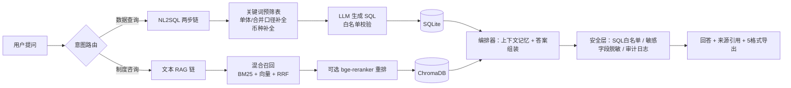

# finance-rag-qa｜财务双通道 RAG 问答系统

[](https://github.com/Elias-love/finance-rag-qa/actions/workflows/tests.yml)


> 面向集团财务场景的自然语言问答：**财务数据走 NL2SQL，规章制度走文本 RAG**，自动识别多公司 / 单体·合并多口径 / 多币种报表。自带评估门禁与安全治理层。

**本仓库所有财务数据均为脚本生成的虚构数据（"星辰集团"体系），与任何真实企业无关。**


## 演示场景

| 提问 | 系统行为 |
|------|---------|
| 「星辰集团合并口径2025年净利润是多少？」 | 路由到 NL2SQL → 自动选中合并报表 → 生成SQL → 返回数据+原表下载 |
| 「辰拓净利润多少」（未指明口径） | 同时返回单体表和合并表两个口径，让用户对照 |
| 「马来西亚星辰的净利润」 | 中文别名桥接英文表名，人民币/林吉特双币种同时返回并标注 |
| 「兴博2025年收入」（同音错字） | 拼音纠错提示候选「星博」，用户确认后查询，绝不静默替换 |
| 「应付月结后要改数据怎么办？」 | 路由到文本 RAG → 混合召回制度文档 → 答案强制附来源引用 |
| 「公司年终奖标准是什么？」（库中无此内容） | 明确回答未找到，不编造 |

## 架构



数据接入：PDF（文本/扫描三通道）、Word、Excel/CSV → 表格清洗入 SQLite，文本切片入 ChromaDB。

## 核心设计

- **双通道路由**：数据问题和制度问题的检索方式完全不同，一条链路吃不下，路由后各走最优路径
- **多公司多口径**：集团场景下"净利润"必须先问清是哪家公司、单体还是合并；系统按问题关键词预筛表，未指明口径时双口径对照返回
- **混合召回**：向量（bge-small-zh）+ BM25（字符二元组，纯 Python 零依赖）双路召回，RRF 融合；精确事务码靠 BM25 兜底，语义近似问法靠向量
- **公司名同音纠错**：拼音匹配找候选 + 用户确认，绝不静默替换（财务场景查错公司比查不到更危险）
- **评估门禁**：32 题黄金测试集（数据/制度/负例三类），改 prompt/阈值/模型前后必跑 `evaluate.py`，总平均评审分不降才可合入
- **安全治理**：SQL 仅允许 SELECT、身份证/银行卡/手机号自动脱敏、全量查询审计日志、登录防爆破

## 规模化演进路线

当前架构定位于**部门级（约 10–50 人）**快速落地。若扩展到集团级（数百人），NL2SQL 需退居长尾兜底，演进方向：

1. **指标语义层**：高频问题（约 80%）不再由 LLM 生成 SQL，而是映射到治理过的预定义指标（口径唯一、一处定义全局生效）——本项目的"关键词预筛 + 口径补全 + 币种配对"即其雏形
2. **受控长尾**：未命中指标的问题走只读视图 + 白名单的受控 NL2SQL，答案标注"非认证口径"
3. **权限下沉**：行级/列级权限在语义层强制注入，LLM 不接触原始表
4. **引擎升级**：SQLite → OLAP（Doris/StarRocks）+ 高频查询缓存

设计原则：财务场景下**给错数字比查不到更糟**，准确率策略必须按问题分层，而非追求单一模型的整体准确率。

## 快速开始

```bash
pip3 install -r requirements.txt
cp .env.example .env                        # 填入 DeepSeek API Key
python3 scripts/generate_mock_data.py       # 生成虚构"星辰集团"报表+制度文档
python3 rebuild_index.py                    # 入库（SQLite + ChromaDB）
python3 -m streamlit run app.py             # 打开 http://localhost:8501
```

- Python 3.10+，无需 GPU；首次运行自动下载 bge-small-zh 嵌入模型（约 100MB）
- LLM 使用 DeepSeek API（OpenAI 兼容接口，可替换为任意兼容端点）

## 评估

```bash
python3 evaluate.py --text-retrieval   # 文本召回评估（本地免API）：纯向量 vs 混合召回
python3 evaluate.py --sweep            # 距离门槛标定，推荐 VEC_DISTANCE_GATE 值
python3 evaluate.py --full             # 端到端评估（调API+LLM评审打分）
```

模拟语料上的文本召回结果（15 正例 + 4 负例，门槛 0.40 由 `--sweep` 标定）：

| 方法 | Hit@5 | MRR | 负例拒答 |
|------|-------|-----|---------|
| 纯向量 | 1.0 | 1.0 | 4/4 |
| 混合召回 | 1.0 | 1.0 | 4/4 |

黄金集在 `eval/golden_set.jsonl`，与模拟数据生成器的输出精确对应；界面上的 👍👎 反馈写入日志，👎 问题定期回收进黄金集。

## 目录结构

```
├── app.py                  # Streamlit 主界面（登录/上传/问答/导出）
├── orchestrator.py         # 编排调度 + 上下文记忆
├── query_router.py         # 意图路由
├── sql_chain.py            # 两步 NL2SQL（预筛表 → 生成SQL）
├── rag_chain.py            # 文本 RAG + 强制引用
├── hybrid_retriever.py     # 混合召回：BM25 + 向量 + RRF + 可选重排
├── company_matcher.py      # 公司名同音纠错
├── document_processor.py   # 文档接入（PDF三通道 + 表格分流）
├── table_extractor.py      # 表格清洗 + SQLite 建模
├── vector_store.py         # 语义切片 + ChromaDB
├── security.py             # SQL白名单 / 脱敏 / 审计日志
├── exporter.py             # Excel/PDF/Word/CSV/MD 五格式导出
├── evaluate.py             # 评估门禁（召回/门槛标定/端到端）
├── scripts/generate_mock_data.py  # 虚构数据生成器（确定性，与黄金集对应）
├── eval/golden_set.jsonl   # 黄金测试集（32题）
├── tests/                  # 单元测试（79 用例）：python3 -m pytest tests/
└── deploy/                 # systemd + nginx 内网部署模板
```

## 部署安全

- `APP_ACCESS_PASSWORD` 留空时任何能访问端口的人都可查询，部署到服务器/内网前**必须**设置
- `ADMIN_PASSWORD` 有默认值告警机制，部署前务必改为强密码
- 登录失败锁定、会话超时、审计日志归档见 `.env.example` 配置项

## 技术栈

Streamlit · DeepSeek API（OpenAI 兼容） · ChromaDB + BAAI/bge-small-zh-v1.5 · SQLite · PyMuPDF · openpyxl / fpdf2 / python-docx

## License

MIT
